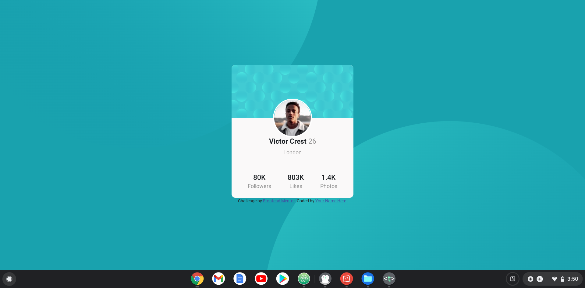
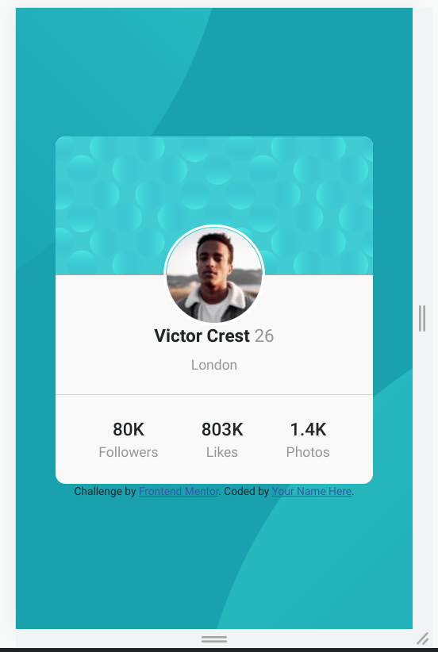

# Frontend Mentor - Profile card component solution

This is a solution to the [Profile card component challenge on Frontend Mentor](https://www.frontendmentor.io/challenges/profile-card-component-cfArpWshJ). Frontend Mentor challenges help you improve your coding skills by building realistic projects.

## Table of contents

-   [Overview](#overview)
    -   [The challenge](#the-challenge)
    -   [Screenshot](#screenshot)
    -   [Links](#links)
-   [My process](#my-process)
    -   [Built with](#built-with)
    -   [What I learned](#what-i-learned)
    -   [Continued development](#continued-development)
    -   [Useful resources](#useful-resources)
-   [Author](#author)
-   [Acknowledgments](#acknowledgments)

## Overview

### The challenge

-   Build out the project to the designs provided

### Screenshot




### Links

-   Solution URL: [Add solution URL here](https://your-solution-url.com)
-   Live Site URL: [Add live site URL here](https://your-live-site-url.com)

## My process

### Built with

-   Semantic HTML5 markup
-   CSS custom properties
-   Flexbox
-   Mobile-first workflow
-   Bootstrap

### What I learned

Use this section to recap over some of your major learnings while working through this project. Writing these out and providing code samples of areas you want to highlight is a great way to reinforce your own knowledge.

To see how you can add code snippets, see below:

```html
<!-- I am rather proud of this html because it was the first application of span and span classes outside of a learning environment.  -->
<h3>
  <span class="name">Victor Crest</span>
  <span class="age">26</span>
</h3>
```

```css
/* learned about how to set multiple background images here */
body{background-image: url(https://www.linkpicture.com/q/bg-pattern-top_2.svg),
url(https://www.linkpicture.com/q/bg-pattern-bottom_1.svg);
/* major learning moment starts here. Setting the position of each seperate background image the first set of values is applied to the first set then a comma seperates the position values for the next image. */
background-position: right 45vw bottom 45vh, 45vw 45vh;}
```

### Continued development
/* I still need to work on positioning. I am still having to heavily reference solutions of other programmers for seamingly easy solutions. I don't copy and paste, and I always end up changing the code because I try and simply and use best practices like not target id's heavily. */

  ### Useful resources

/* -Great for learning about flexboxes. [https://css-tricks.com/snippets/css/a-guide-to-flexbox/] */
## Author

- Frontend Mentor - [@Henryallthumbs](https://www.frontendmentor.io/profile/Henryallthumbs)

**Note: Delete this note and add/remove/edit lines above based on what links you'd like to share.**

## Acknowledgments

shout out to @ladyofthecave her Frontendmentor solution really helped to get me going.
```
